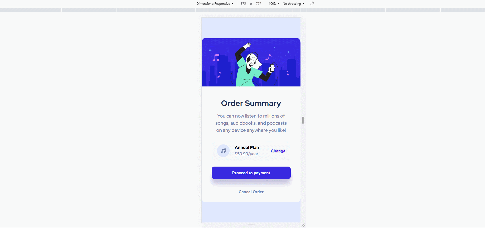

# Frontend Mentor Challenge - Order summary card solution

This is a solution to the [Order summary card challenge on Frontend Mentor](https://www.frontendmentor.io/challenges/order-summary-component-QlPmajDUj). Frontend Mentor challenges help you improve your coding skills by building realistic projects.

## Table of contents

- [Frontend Mentor Challenge - Order summary card solution](#frontend-mentor-challenge---order-summary-card-solution)
  - [Table of contents](#table-of-contents)
  - [Overview](#overview)
    - [The challenge](#the-challenge)
    - [Result](#result)
    - [Link](#link)
  - [My process](#my-process)
    - [Built with](#built-with)
  - [Author](#author)

## Overview

### The challenge

Users should be able to:

- See hover states for interactive elements

### Result

### Link

- Vercel - [https://order-summary-component-three-psi.vercel.app/](https://order-summary-component-three-psi.vercel.app/)

## My process

### Built with

- Semantic HTML5 markup
- CSS custom properties
- Flexbox

## Author

- Linkedin - [https://www.linkedin.com/in/gabriel-mariano-470028180/](https://www.linkedin.com/in/gabriel-mariano-470028180/)

